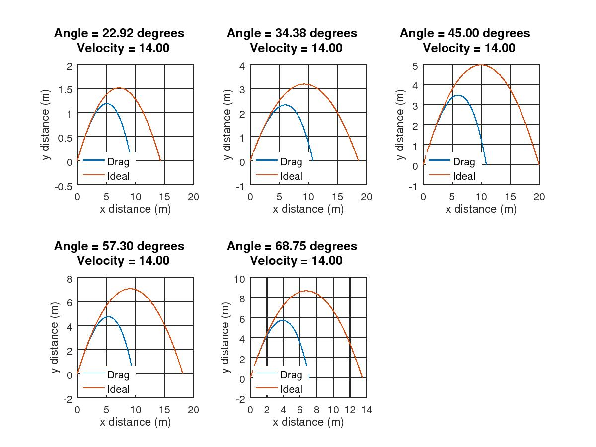

# Projectile Motion
This project aims at comparison of the motion of a projectile thrown at an angle to the horizon with zero vs quadratic air drag force. With zero air drag force, the analytic solution is well known. The trajectory of the projectile is a parabola. 

In situations of practical interest, such as throwing a ball with the occurrence of the impact of the medium the quadratic resistance law is usually used. In that case the problem probably does not have an exact analytic solution and therefore in most scientific publications it is solved numerically. 

Analytic approaches to the solution of the problem are not sufficiently advanced. I here compare the motion computationally and look forward to use this data to provide/verify analytical solutions of the problem since they are very convenient for a straightforward adaptation to applied problems and are especially useful for a qualitative analysis.

### Graphs:

****